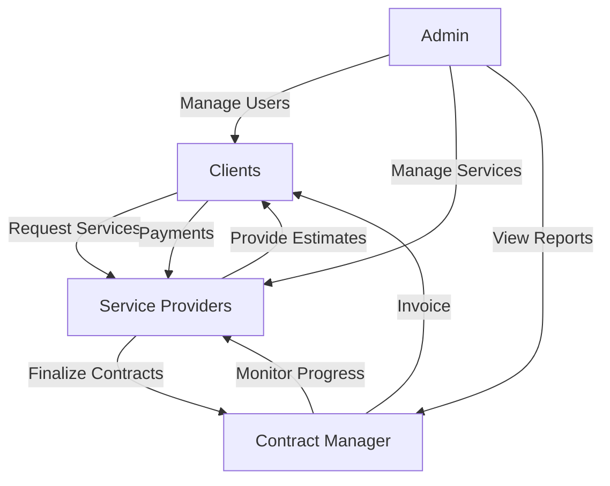

```mermaid
    graph TD;
        A[Clients] -->|Request Services| B[Service Providers];
        B -->|Provide Estimates| A;
        B -->|Finalize Contracts| C[Contract Manager];
        C -->|Monitor Progress| B;
        C -->|Invoice| A;
        A -->|Payments| B;
        D[Admin] -->|Manage Users| A;
        D -->|Manage Services| B;
        D -->|View Reports| C;
```